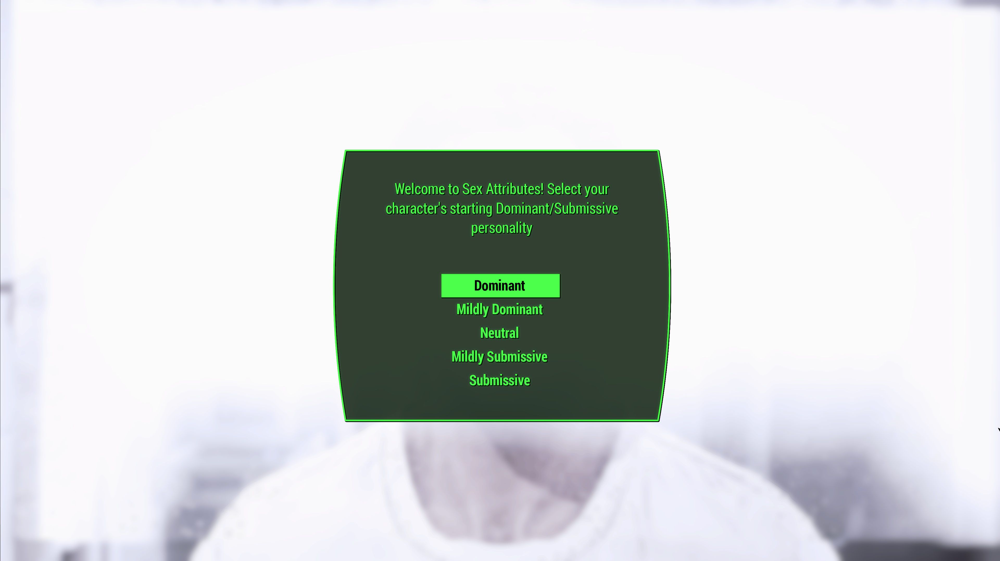
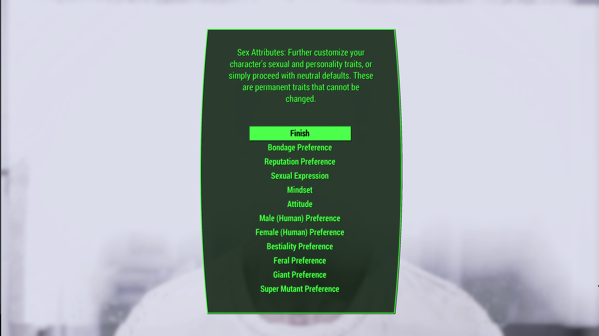
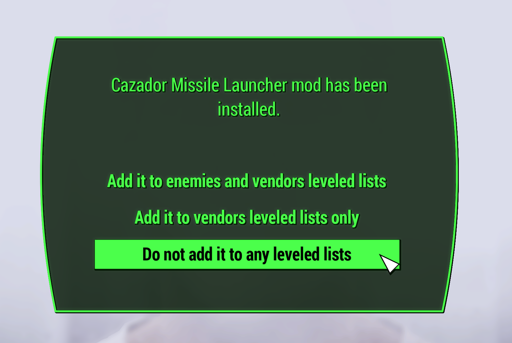
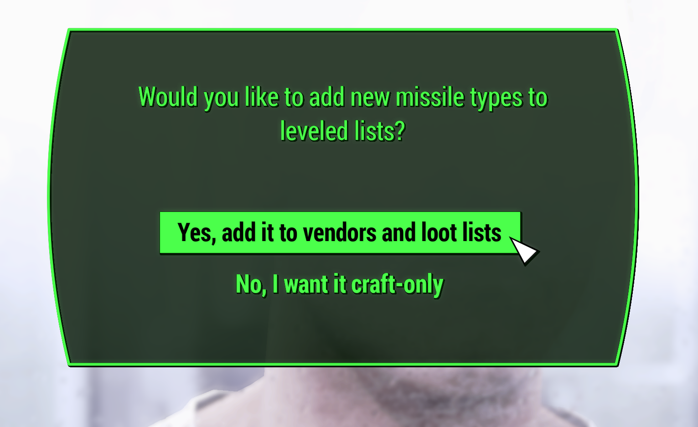
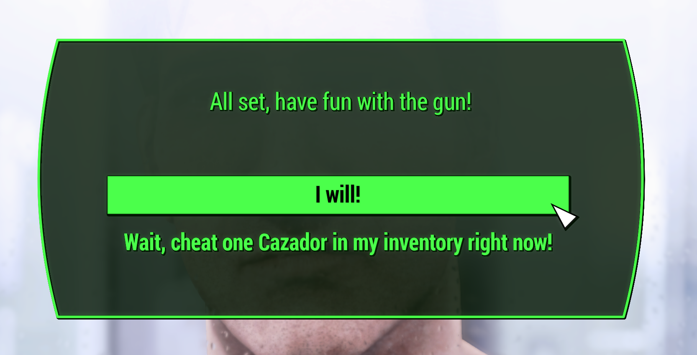

**IMPORTANT:** This is a Fallout 4 modlist that contains adult content. To access this content you need to be 18 years of age (in most countries), 21 in other. Please make sure that you fullfill the legal specifications of your country.

**For general support and talk about the modlist, join the Fallen Society Discord:**

[](https://discord.gg/cprgvBUCpH)

# ToC
- [Fallen Society](#fallen-society)
- [Before you start](#before-you-start)
  - [Hardware requirements](#hardware-requirements)
  - [DLC \& Creation Club Content](#dlc--creation-club-content)
- [Installation](#installation)
  - [Preparation](#preparation)
    - [Microsoft Visual C++ Redistributable Packages](#microsoft-visual-c-redistributable-packages)
    - [Page file setup](#page-file-setup)
    - [Setup your Shader Cache](#setup-your-shader-cache)
    - [Disable Steam Overlay](#disable-steam-overlay)
    - [Set game language to English](#set-game-language-to-english)
    - [Change Steam's Updating Behavior](#change-steams-updating-behavior)
    - [Clean current Fallout 4 installation](#clean-current-fallout-4-installation)
    - [Install Fallout 4](#install-fallout-4)
    - [Start Fallout 4](#start-fallout-4)
  - [Wabbajack](#wabbajack)
  - [Post Installation](#post-installation)
    - [Mod Organizer 2](#mod-organizer-2)
    - [Stock Game](#stock-game)
    - [Create Desktop Shortcut](#create-desktop-shortcut)
 - [Starting Your Game](#starting-your-game)
    - [Step One](#step-one)

# Fallen Society
Society has fallen. Every structure of order has been burned in the nuclear fire. It is up to you to rebuild society in the Commonwealth and keep your dignity as well as your sanity in tact. Are you up for the task?

# Before you start
Please read carefully and check every requirement here:

## Hardware requirements
I have a decent setup at home with the following specs:
- CPU: Intel(R) Core(TM) i7-10700K CPU
- RAM: 96GB DDR4
- GPU: NVidia RTX 3080 (12GB VRAM)

So that should give you an idea of what you need (except for the RAM maybe. 32GB should be more than enough).

I play at 4k resolution (3840 x 2160) and have constant 60FPS in most areas. Of course there are some drops here and there but nothing major and nothing below 40FPS for more than a second. The list should be very performant.

You should have at least ```180 GB``` of free space on an SSD (better -> m.2 SSD) for the installation and an additional ```80 GB``` for the downloads. So you would need to have around ```260 GB``` of free space. If you insist on installing this list on an HDD, than prepare yourself for painfull and hard installation! You are warned.

## Accounts
You need the following accounts to download this list:
- Nexus Premium Account (you can use free, but it would take ages)
- LoversLab Account
- Moddingham Account (needed for the lates AAF version)

## DLC & Creation Club Content
You need all Fallout 4 DLC except for the official HD texture pack. **DON'T INSTALL IT!**
Creation Club content is and will not be supported.

# Installation
At this point you should have read everything that came before und didn't skip anything. The next section requires a lot of attention so read carefully.

## Preparation

### Microsoft Visual C++ Redistributable Packages
This is hard requirement for MO2 to operate. You may already have it installed, if not, download the x64 version under "Visual Studio 2015, 2017 and 2019) here:
[Download Visual C++ Redistributable Package.](https://docs.microsoft.com/en-us/cpp/windows/latest-supported-vc-redist?view=msvc-170)

### Page file setup
Fallout 4 modlists need a large amount of memory purely because of the amount of *stuff* in them - especially modlists on the larger side or with a lot going on. For the best experience, you should setup a pagefile of at least **20GB** - yes, even if you have a million GB of RAM. To setup your pagefile;

1. Hold down the *LEFT* Windows key and press **R**
2. Type in `systempropertiesadvanced` in the run box and then press ENTER
3. Under the "Performance" option, click the "Settings..." button
4. Switch to the "Advanced" tab
5. Under "Virtual Memory", click the "Change..." button
6. Uncheck `Automatically manage...` if it's checked
7. Select your *fastest* SSD in the list of drives
8. Check "Custom Size"
9. Set `Initial Size` to 20480
10. Set `Maximum Size` to 20480 also
    1.  *Note: you can set this up to 40000 if you have the space, this will let the pagefile expand to as large as 40GB*
11. Press the "Set" button
12. Press OK
13. Press APPLY and then OK
14. Restart your PC to apply the pagefile setting

### Setup your Shader Cache
Driver defaults from Nvidia and AMD for shader cache size is limited to 4GB. Being this small can lead to rare crashes in heavily modified Fallout 4 installs. Increasing the shader cache size is done via the Nvidia Control Panel (I assume the same for AMD users is true also but I don't have AMD hardware to check with). 

*These instructions are Nvidia specific as it is the hardware I have.*

1. Open the NVidia Control Panel
2. Head to `Manage 3D Settings`
3. Scroll down in `Global Settings` to find the `Shader Cache Size` option
4. Set the Shader Cache to *at least* 10GB
5. Done


### Disable Steam Overlay
The Steam overlay is known to cause issues when using ENBs. I recommend you turn it off to be sure that it doesn't interfere in any way and you can do so by heading into Steam, right clicking on Fallout 4 in your game library and clicking **Properties** > **General** > **Deselect "Enable Steam Overlay while in-game"**.

### Set game language to English
Wabbajack and some/most of the modding tools out there only support English language versions of games. Setting the language to English in Steam will stop issues like Wabbajack file verification failures when installing. As with disabling the overlay, right click on Fallout 4 in your game library and click **Properties** > **Language** > **Select English**.

### Change Steam's Updating Behavior
If for some reason Bethesda decide to release an update for Fallout 4, everything will probably break. Well, not *everything* but something will definitely break until mods can be updated to suit. To stop this from happening, you need to tell Steam that you only want to update when you tell it to. You can do this by right clicking on Fallout 4 in your game library and clicking **Properties** > **Updates** > **Change Automatic Updates to "Only update this game when I launch it"**. Whilst you're in here, it's also recommended to disable Steam Cloud too.

### Clean current Fallout 4 installation
If you have not yet installed Fallout 4, you can skip this part.

1. Right click on Fallout 4 in your game library and click **Properties** > **Local Files** > **Browse**. 
2. Uninstall the game via Steam - right click on Fallout 4 in your game library and click **Manage** > **Uninstall**.
3. Check the explorer window for any left over files - if there are any, delete them.
4. Open Windows start menu/search and type in `%LOCALAPPDATA%`.
5. Delete the Fallout 4 folder.
6. Head to `Documents\My Games` and delete the Fallout 4 folder.

### Install Fallout 4
Once you've done the steps above, you can now set Steam to download Fallout 4 again but ***do not*** install Fallout 4 to a protected folder, such as `Desktop`, `Downloads` or `Program Files` of any kind. It's best to create a new, dedicated folder for it using the Steam Library function somewhere on the root of your drive such as `C:\SteamLibrary`. A lot of people have a dedicated secondary drive for their games, keeping the OS install separate; using this secondary drive will also work.

### Start Fallout 4
That's right - start the game. You need to let the game do its initial start up jobs such as creating registry entries and generating default config files. Once you've gotten to the main menu you can close the game again.

## Wabbajack
Installing the list is straight forward, Wabbajack will do most of the heavy lifting for you - you only have to tell it where to put stuff.

Set the installation location to a folder on the root of a drive, something like `C:\FallenSociety`. Do not install it to one of the protected folders as mentioned earlier. The download location will have likely been filled in for you too - ensure it matches the directory you set for the installation location, or if you have multiple Fallout 4 modlists installed, use a common download folder - this will stop you from having to redownload common mods across multiple modlists. 

Before you hit **GO**, a quick tip:

*To get the best performance with Wabbajack, it is recommended that you have the install folder for Wabbajack, the modlist folder and the downloads folder on an SSD; ideally the same SSD.* After the installation is complete, you can move the downloads folder to a storage HDD or other storage medium to save space on your game installation drive. It's not recommended to allow your drive to exceed 90% of its storage space used - Windows Explorer will show a red bar under your drive if you do go over 90% so you need to be sure that you have enough space on your installation drive so that you won't exceed this 90% storage level.

Once you have everything set in Wabbajack, hit **GO** and let it do its thing. It might take a while as there is a fair bit to download and the speed of this will depend on your internet performance as well as your CPU in the later stages for hashing and unpacking the downloads.

# Post Installation
If you made it this far, chances are good you will make it to the end.

## Mod Organizer 2
Once everything is downloaded and you closed Wabbajack, head to the installation folder an run ModOrganizer2.exe.

**VERY IMPORTANT: DON'T RUN LOOT! THE LOADORDER IS EXACTLY AS IT SHOULD.**

## Stock Game
Fallen Society utilises the stock game feature offered by Wabbajack, meaning that Wabbajack will make a local copy of your Fallout 4 game files during the installation process. This means that your Steam installation of Fallout 4 is completely untouched, even by files that go in the game folder such as ENB files.

## Create Desktop Shortcut

# Starting Your Game
If everything is done, you can begin your journey into the wasteland. Read carefully!

## Step One
When you press New Game in the main menu you will be immediatly greeted with an pop-ip. This is from the Hardship mod. Just click okay and forget. After the intro video the Cheat Terminal pop-up will occur. Do the same, just click and forget.

## Step Two
Now you will be greeted with these two pop-ups (see images below). Choose your sexual preferences and traits. On the second page, click finish **after** you choose everything to your liking.


Just choose one.


Check every menu **before** hitting that finish button!

## Step Three
The modlist uses a weapon replacer that injects weapons from other mods into the game and replaces the vanilla ones. Unfortunately, most of the original mods have options to inject them into the game. This is not needed after they are replaced, but it is not possible to deactivate every mods menu. So, this is up to us now for **two** weapon mods.

The first one is the cazador missle launcher and will appear before you create your character.


**Choose: Do not add to leveled lists.** After that, click ok.


**Choose: Yes, add it to vendors and loot lists.** I am not actually sure if that is needed, but for now, just do it. After that, click ok.


**Choose: I will!**

## Step Four
After that is done, just create your character. **NOTE:** This modlist configured for female characters. Male characters are not supported for now. If you choose to play as a male, you are on your own.

## Step Six
After you create your character and hit that "done" button, **DO NOTHING!!!** Just wait until the AAF pop-ups appear. Just click okay and then wait until the messages in the top left corner stop appearing.

## Step Seven
After the mod messages have dissappeared and only then you may proceed to through the bathroom door. Here you can choose what to do. 

**WARNING:** I have never tested the vanilla start with this list and I never will, but im pretty sure it will break the game. So please choose the "It's only a dream..." option and start in the wasteland. Also better for roleplaying.
